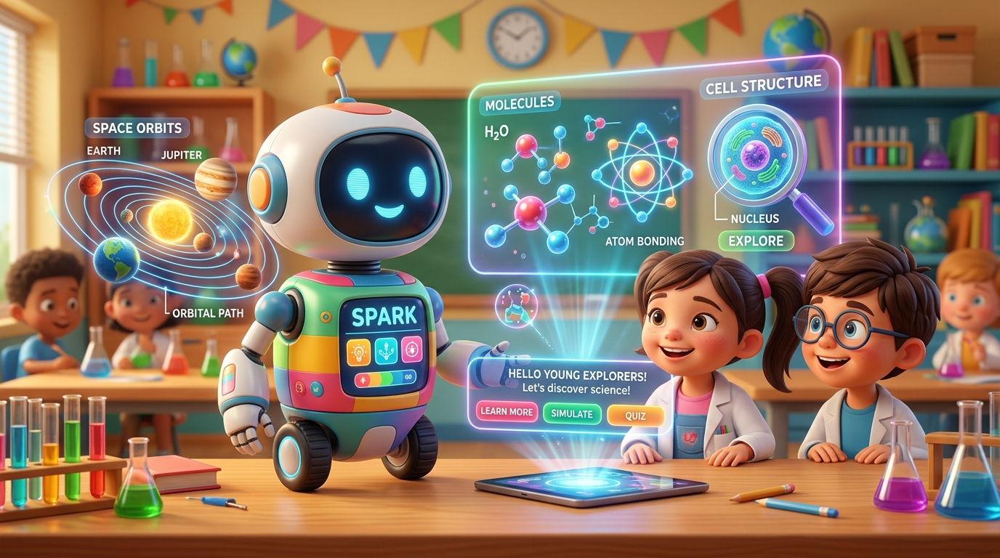

# 🧪 POLYQUEST — Next-Gen Interactive Kids Science & AI Learning Platform

<div align="center">


<br /><br />

[](https://kidos-liard.vercel.app/)
[](https://react.dev/)
[](https://vitejs.dev/)
[](https://www.typescriptlang.org/)
[](https://tailwindcss.com/)
[](https://www.framer.com/motion/)
[](https://deepmind.google/technologies/gemini/)

<br />

> **A playful, hands-on, character-driven STEM learning universe for young scientists (Ages 8–14).**  
> *Combining the tactile physics of PhET, the gamified adventure of Duolingo, and the real-time curiosity of Google Gemini AI!*

[✨ Experience Live Demo](https://kidos-liard.vercel.app/) • [🔬 Science Themes](#-science-curriculum--themes) • [🤖 AI Science Lab](#-gemini-powered-ai-science-companion) • [🎮 Interactive Studios](#-tactile-science-studios--simulators) • [🚀 Quick Start](#-quick-start)

</div>

---

## 🌟 Why PolyQuest?

Traditional science textbooks present facts as static paragraphs and memorized formulas. **PolyQuest** transforms CBSE & NCERT elementary science curricula into **tangible virtual physics sandboxes, macro-photography experiments, and voice-guided inquiry challenges**.

Guided by **Pip**—an expressive, curious AI scientist companion—children explore real materials, manipulate variables, listen to natural neural speech, and solve real-world mysteries.

```
       [ 🌿 Observe Nature ]           [ 🔬 Hands-On Sandbox ]          [ 🎯 Socratic Discovery ]
     Ant trails, Everest peaks,   ──►   Move sliders, apply heat,  ──►    Understand WHY it works
      plastic decay & circuits          seal leaks & test forces          with zero plain emojis!
```

---

## 🔬 Science Curriculum & Themes

<table width="100%">
  <tr>
    <td width="33%" align="center">
      <h3>🐜 Theme 1: Super Senses</h3>
      <p><b>Animal Biology & Sensory Physics</b></p>
      <p align="left">
        • <b>Ant Pheromone Trail</b>: Sugar scent paths & obstacles<br />
        • <b>Eagle Telescopic Eyes</b>: 4x human visual acuity zoom<br />
        • <b>Snake Infrared Vision</b>: Thermal pit-organ night hunt<br />
        • <b>Dog Olfactory Navigation</b>: Moisture & scent particle grids
      </p>
    </td>
    <td width="33%" align="center">
      <h3>🏔️ Theme 2: Shelter & Earth</h3>
      <p><b>Physics, Geography & Architecture</b></p>
      <p align="left">
        • <b>Mt. Everest Barometer</b>: Altitude vs. atmospheric pressure<br />
        • <b>Pashmina vs. Hair</b>: 200x optical microscope fibers<br />
        • <b>Golconda Fort Acoustics</b>: Persian water-wheels & bastions<br />
        • <b>Seismic Shake Table</b>: Earthquake-resistant dampers
      </p>
    </td>
    <td width="33%" align="center">
      <h3>🧪 Theme 3: Synthetic Materials</h3>
      <p><b>Polymers, Electricity & Chemistry</b></p>
      <p align="left">
        • <b>The Raincoat Mystery</b>: Hydrophobic polyester beads<br />
        • <b>Super-Nylon Pull</b>: Tensile strength vs steel cords<br />
        • <b>Flame Reaction Chamber</b>: Melting plastics vs cotton ash<br />
        • <b>Live Circuit Sandbox</b>: PVC insulators & copper wires
      </p>
    </td>
  </tr>
</table>

---

## 🤖 Gemini-Powered AI Science Companion

<div align="center">
  
</div>

<br />

PolyQuest features an integrated suite of **Google Gemini-powered multimodal learning assistants**:

1. 🎙️ **Live Pip Voice Sidecar**: Floating AI tutor that speaks with natural human voice synthesis (`en-US-AnaNeural`), provides real-time soundwave visualizations, and answers any science question on the fly.
2. 📸 **Scan My World (Object Identifier)**: Uses device camera or uploads to scan real household objects (plastic spoons, wool socks, copper wires) and explains their material composition and atomic properties.
3. 💡 **"What If?" Science Sandbox**: Children can ask hypothetical curiosity questions (*"What if Earth had zero gravity?"*, *"What if water didn't evaporate?"*) and watch generative visual explanations.
4. 🧠 **Socratic AI Coach**: Encourages critical thinking by offering step-by-step Socratic hints rather than spoiling answers directly.

---

## 🎮 Tactile Science Studios & Simulators

* **🚰 High-Pressure Pipe Leak Simulator (Mission 12)**:
  * High-pressure plumbing rupture blasting water at **80 PSI**.
  * Test natural tree resin (washes away) vs **2-part synthetic structural epoxy** (cures underwater to 0 PSI).
* **🏎️ Formula 1 Tire Friction Bench (Mission 11)**:
  * Interactive RPM slider (1,000–12,000 RPM) and friction thermal gauge (25°C–160°C).
  * Natural latex sap melts vs **vulcanized rubber with sulfur cross-links** gripping the asphalt.
* **👕 Fabric Wrinkle & Crumple Rig (Mission 4)**:
  * Tangible press testing natural cotton (permanent creased folds) vs synthetic polyester (springs back 100% wrinkle-free).
* **⏳ 500-Year Soil Time Chamber (Mission 10)**:
  * Time-travel slider comparing biodegradable organic wood vs non-biodegradable synthetic polymers persisting over 450+ years.
* **⚡ Live Circuit Conductor Sandbox (Mission 8)**:
  * Place real specimens (copper wire, steel key, PVC cable, rubber) to complete electrical circuits and illuminate the lightbulb.

---

## 🕹️ Gamification, Arcade & Daily Quests

* **🏆 Science Arcade**: 6 fast-paced mini-games testing reflex sorting, circuit troubleshooting, and material memory matching.
* **🌟 Daily Curiosity Quests**: Daily challenges to build long-term learning habits and earn science coins.
* **📖 Field Specimen Journal**: Interactive sticker album documenting all discovered natural and synthetic specimens.
* **🎶 Dynamic Environmental Audio (`bgmEngine`)**: Custom ambient soundscapes for mountain peaks, rainforests, stormy campsites, and clean laboratories.

---

## 🛠️ Technology Stack

| Layer | Technology |
|---|---|
| **Frontend Framework** | React 19 + TypeScript 6 |
| **Build & Bundler** | Vite 8.2 (Lightning fast HMR) |
| **Styling & Design** | Tailwind CSS v4.0 (3D tactile gamified design tokens) |
| **Motion & Physics** | Framer Motion 13 (Spring physics, drag-and-drop, particle overlays) |
| **Artificial Intelligence**| Google Gemini 2.0 Flash SDK (Multimodal vision + conversational tutor) |
| **Speech & Audio** | Web Speech API (`en-US-AnaNeural`) + Web Audio API Synthesizers |
| **State Management** | Zustand (Persistent local storage & progress caching) |
| **Icons & Media** | Lucide React + High-Resolution Studio Macro Photography |

---

## 🚀 Quick Start

### Prerequisites
- **Node.js**: `v18.0.0` or higher
- **npm** or **pnpm**

### Installation

```bash
# 1. Clone the repository
git clone https://github.com/rachitmalik-byte/kidos.git

# 2. Navigate to project directory
cd kidos

# 3. Install dependencies
npm install

# 4. Start local development server
npm run dev
```

Visit **`http://localhost:5173/`** in your browser to start exploring!

### Production Build
```bash
npm run build
npm run preview
```

---

## 👨‍👩‍👧 Parent & Teacher Portal

PolyQuest includes a dedicated **PIN-gated Parent & Educator Portal**:
* **🔒 4-Digit Security PIN**: Prevents children from modifying settings.
* **📊 Learning Analytics**: Track completed missions, mastered concepts, and quiz scores.
* **💡 5-Minute Real-World Home Prompts**: Conversational prompts for dinner-table science discussions (e.g. *"Find 3 synthetic polymers in the kitchen!"*).

---

## 📄 License & Attribution

* **License**: MIT License.
* **Curriculum Alignment**: CBSE Class 5–6 Science / NCERT / Next Generation Science Standards (NGSS).
* **Mascot & Design**: Developed with ❤️ for young curious minds everywhere!

<br />

<div align="center">
  <b>⭐ Star this repository if you believe science education should be hands-on and magical! ⭐</b>
</div>
