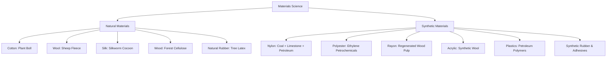

<div align="center">

# 🧪 POLYQUEST
### The World of Synthetic Materials — Interactive Kids EdTech

[](https://vitejs.dev/)
[](https://react.dev/)
[](https://www.typescriptlang.org/)
[](https://tailwindcss.com/)
[](https://www.framer.com/motion/)
[](LICENSE)

<br />

> **A playful, gamified, character-driven science learning experience designed for Grade 5–6 students.**  
> Inspired by the design philosophies of *Duolingo*, *Toca Boca*, and *Nintendo Switch* interfaces.

[Explore Live Demo](#-live-demo) • [Key Features](#-key-features) • [Curriculum](#-science-curriculum-covered) • [Quick Start](#-quick-start) • [Architecture](#-project-architecture)

<br />

```
 ____________________________________________________________________________
|                                                                            |
|   🧵 Raincoat Hydro-Test  •  💪 Super-Nylon Pull  •  🔥 Flame Safety Test   |
|   ⚡ Wire Insulation      •  🫖 Kettle Handles    •  🌍 Plastic Problem    |
|____________________________________________________________________________|
```

</div>

---

## 🌟 Why PolyQuest?

Traditional science textbooks often present synthetic materials as dry lists of definitions and chemical reactions. **PolyQuest** transforms Chapter 2 & 3 science concepts into **interactive tactile experiments**, guided by **Pip**, an expressive animated AI science companion with natural human speech narration.

```
       [ 🌿 Natural Materials ]             [ 🏭 Synthetic Materials ]
         (Plants, Animals, Trees)               (Petroleum, Limestone, Chemicals)
                    │                                      │
                    └───► 🧱 MATERIAL  ──► ⚡ PROPERTY ──► 🎯 USE ◄───┘
```

---

## ✨ Key Features

### 1. 🎮 Chunky 3D Gamified Interface
- **Board Game Adventure Trail**: 13 progressive stepping-stone missions with unlocking criteria, star ratings, and celebratory rewards.
- **Tactile 3D Controls**: Satisfying pressable buttons (`btn-3d-amber`, `btn-3d-emerald`), elevated cards, and bouncy animations.
- **Zero Raw Emojis**: 100% custom scalable SVG vector illustrations for scientific accuracy and visual polish.

### 2. 🎙️ Neural Human-Like Voice Assistant (Pip)
- **Natural Cadence**: Friendly pacing (`0.92x`) and warm pitch (`1.06x`) with natural conversational pauses.
- **Audio Equalizer Visualizer**: Real-time 5-bar animated soundwave display whenever Pip is talking.
- **Universal Audio Navigation**: Dedicated SFX and Voice mute/unmute toggles in top navigation bars.

### 3. 📖 Instant Text-Selection Science Dictionary
- **Highlight or Double-Click ANY Word**: Double-click or drag-select any word across any page to instantly reveal a floating cartoon Science Dictionary card.
- **Phonetic Pronunciation Guide**: Helps children pronounce complex terms (e.g., `[sin-THET-ik]`, `[by-oh-dih-GRAY-duh-bul]`).
- **Instant Audio Narration**: Pip automatically reads the term, definition, and real-world example sentence aloud.

### 4. 🔬 13 Interactive Hands-On Science Missions
| # | Mission | Core Learning Experiment |
|---|---|---|
| **M1** | 🌧️ **The Raincoat Mystery** | Hydro-dropper water spray test (Cotton soaked vs. Polyester waterproof) |
| **M2** | 🌿 **The Sorting Desk** | Nature Oasis vs. Invention Lab specimen classification trays |
| **M3** | 💪 **The Strength Test** | Tensile machine: Cotton (10kg) vs Silk (20kg) vs Steel (40kg) vs **Nylon (55kg)** |
| **M4** | ✨ **Fabric Lab** | Polyester, Rayon (semi-synthetic artificial silk), and Acrylic (synthetic wool) |
| **M5** | 🔥 **Fire Safety Station** | Flame burn test (Cotton burns to ash vs Polyester melts into hot sticky beads) |
| **M6** | ☀️ **Summer Comfort** | Perspiration breathability and sweat allergy prevention in 40°C heat |
| **M7** | 🫙 **Plastic World** | 4 core advantages of plastics + thermo-moulding under heat & pressure |
| **M8** | ⚡ **Pip's Electrical Wire** | Wire assembly: Copper conductor core + Plastic insulator sleeve |
| **M9** | 🫖 **Save Pip's Hand!** | Boiling kettle experiment with heat-resistant Bakelite handle |
| **M10**| 🌍 **The Plastic Problem** | Biodegradable vs. Non-biodegradable time tunnel & microplastics |
| **M11**| 🛞 **Stretch Lab** | Natural tree latex vs. high-friction synthetic rubber tyres |
| **M12**| 🧴 **The Repair Station** | Synthetic adhesives & high-pressure waterproof pipe leak sealing |
| **M13**| 🏕️ **Pip's Science Camp** | Grand Master Quiz & Official Junior Scientist Certificate! |

### 5. 🛡️ Parent Coaching & Progress Portal
- **4-Digit PIN Security Gate**: Keeps parental dashboard secure.
- **Mastery Analytics**: Track completed missions and discovered concepts.
- **💡 5-Minute Real-World Home Activities**: Quick conversation starters for parents (e.g. *Spot the Nylon in your toothbrush*, *Compare cotton vs jersey shirts*).

### 6. ⚙️ Developer Super-Hacks Drawer (`DEV` Badge)
- Discreet floating badge that expands into a full QA testing suite:
  - 🚀 **1-Click Fast Travel**: Jump to any page or mission directly.
  - 🔓 **Progression Cheats**: *Unlock All Missions*, *Reset Progress*, *Unlock All Specimens*.
  - 🎙️ **Audio & TTS Studio**: Test Web Audio sound synthesizers and speech engines.
  - 📊 **Realtime State Inspector**: Live inspection of local storage cache.

---

## 📚 Science Curriculum Covered



---

## 🛠️ Tech Stack

- **Frontend Framework**: [React 19](https://react.dev/) + [TypeScript](https://www.typescriptlang.org/)
- **Build Tool**: [Vite 8](https://vitejs.dev/) with [@tailwindcss/vite](https://tailwindcss.com/)
- **Styling**: [Tailwind CSS v4](https://tailwindcss.com/) with custom 3D game UI tokens
- **Animations**: [Framer Motion](https://www.framer.com/motion/) + [DotLottie React](https://lottiefiles.com/)
- **State Management**: [Zustand](https://zustand-demo.pmnd.rs/) with persistent `localStorage` middleware
- **Audio Engines**:
  - Procedural Web Audio Synthesizer (Zero-latency SFX)
  - Web Speech API with Neural Voice Selection (Natural TTS)
- **Routing**: [React Router v7](https://reactrouter.com/) (Vercel SPA rewrite ready)
- **Icons**: [Lucide React](https://lucide.dev/) + Custom Vector SVG Library

---

## 🚀 Quick Start

### Prerequisites
- Node.js 18+ (Node.js 20+ recommended)
- npm, yarn, or pnpm

### Installation

```bash
# 1. Clone the repository
git clone https://github.com/rachitmalik-byte/kidos.git

# 2. Navigate to project directory
cd kidos

# 3. Install dependencies
npm install

# 4. Start the local development server
npm run dev
```

Visit `http://localhost:5173/` in your browser.

### Production Build

```bash
# Build optimized bundle for production
npm run build

# Preview production build locally
npm run preview
```

---

## 📁 Project Architecture

```
polyquest-app/
├── public/                 # Favicons and static SVG icons
├── src/
│   ├── components/
│   │   ├── dev/            # Developer super-hacks drawer (DevDrawer.tsx)
│   │   ├── dictionary/     # Text-selection smart dictionary (GlobalWordExplainer.tsx)
│   │   ├── feedback/       # Celebration & mistake animations
│   │   ├── illustrations/  # Custom scalable vector illustrations (MaterialIllustrations.tsx)
│   │   ├── navigation/     # Dual audio & home navbar controls (AudioNavBarControls.tsx)
│   │   ├── pip/            # Animated SVG mascot & speech bubble (Pip.tsx, PipSpeechBubble.tsx)
│   │   └── ui/             # Reusable buttons, cards, and modal components
│   ├── data/
│   │   ├── materials.ts    # Comprehensive textbook material profiles & facts
│   │   ├── missions.ts     # Metadata & step sequences for all 13 missions
│   │   └── vocabulary.ts   # Science dictionary database with normalizer & fallback
│   ├── features/
│   │   ├── chapter-hub/    # Gamified board-game adventure map
│   │   ├── chapter-intro/  # Opening scene with animated floating objects
│   │   ├── discovery-book/ # Collectible specimen field journal
│   │   ├── missions/       # Interactive mission workbenches & DynamicMissionEngine
│   │   ├── parent/         # Parent onboarding setup, PIN gate & dashboard
│   │   └── role-selection/ # Main entry page (Scientist vs Parent)
│   ├── lib/
│   │   ├── sounds.ts       # Procedural Web Audio synthesizer (pop, splash, fanfare)
│   │   └── voiceAssistant.ts # Emotive Neural TTS speech engine
│   ├── stores/             # Persistent Zustand stores (audio, progress, parent, discovery)
│   ├── types.ts            # Global TypeScript definitions
│   └── index.css           # 3D button tokens, elevation & font typography
├── vercel.json             # Vercel SPA routing rewrite rules
└── package.json
```

---

## 🤝 Contributing

Contributions, bug reports, and pedagogical improvements are welcome!

1. Fork the Project
2. Create your Feature Branch (`git checkout -b feature/AmazingScienceMission`)
3. Commit your Changes (`git commit -m 'feat: Add new polymer tensile test'`)
4. Push to the Branch (`git push origin feature/AmazingScienceMission`)
5. Open a Pull Request

---

## 📄 License

Distributed under the **MIT License**. See `LICENSE` for more information.

<div align="center">

Made with 🧪 and 💜 for young scientists everywhere.

</div>
