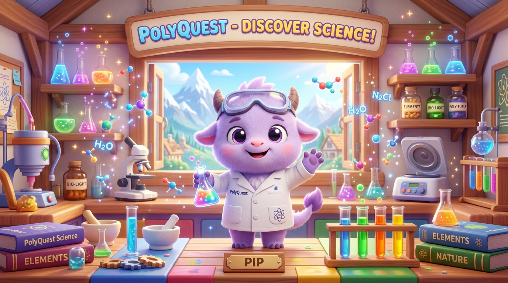

# 🌿 KIDOS v2 — Next-Gen STEM Learning & Biophilic 3D Living World Platform

<div align="center">



<br /><br />

[](https://github.com/rachitmalik-byte/verson2-kidos)
[](https://threeui.com/hero/sylva/living-green)
[](https://react.dev/)
[](https://threejs.org/)
[](https://www.typescriptlang.org/)
[](https://vitejs.dev/)
[](https://tailwindcss.com/)

<br />

> **An immersive, biophilic, hands-on STEM learning universe for curious young minds (Ages 8–14).**  
> *Blending ThreeUI's ultra-premium "Sylva Living Green" 3D world, PhET tactile physics sandboxes, and AI-guided Socratic inquiry.*

[🌿 Living Green Biome](#-threeui-sylva-living-green-experience) • [🔬 Curriculum Modules](#-curriculum--interactive-biomes) • [🎮 Hands-On Labs](#-tactile-science-laboratories) • [🚀 Quick Start](#-quick-start) • [🛠️ Tech Stack](#-technology-stack)

</div>

---

## 🌟 What is Kidos v2?

**Kidos v2** elevates elementary science education from static textbooks into **interactive living worlds, 3D bio-simulations, and real-time physical inquiry sandboxes**.

Instead of memorizing facts, children touch, test, and discover:
- How **leaf and seed micro-structures** inspired revolutionary human inventions like Velcro.
- How **ants communicate** using chemical pheromone highways.
- How **snakes perceive ground tremors** through acoustic jawbone compression.
- How **materials differ at the microscopic level** under multi-tier digital microscopes.

```
       [ 🌿 Living 3D World ]          [ 🔬 Multi-Tier Bio-Labs ]       [ 🎯 Socratic Discovery ]
     130,000+ moss blades, flora, ──►  Micro-scans, audio physics, ──►   Understand natural laws
      pollen drift & flying fauna       tensile pulls & chemical labs    with AI voice coaching
```

---

## 🌿 ThreeUI "Sylva Living Green" Experience

Kidos v2 integrates the official **ThreeUI `SylvaHero`** engine (`@designcodeio/threeui`), delivering an ultra-premium biophilic aesthetic for the **Plants & Living World** curriculum:

- **130,000+ Instanced Moss Blades**: Procedurally generated living moss carpet with sunlight transmission shading.
- **Drifting Pollen & Spore Simulation**: Floating bioluminescent particles responding organically to mouse/touch pointer deflection.
- **Articulated 3D Flying Butterfly**: Smooth Lissajous flight path, aerodynamic banking into curves, and gentle landing kinematics.
- **Liquid-Metal WebGL2 Dispersion Controls**: Native 5-pass dispersion shader controls with chromatic fringing, ripple waves, and specular rim lighting.
- **Frosted Obsidian Glassmorphism**: High-contrast dark botanical HUDs (`backdrop-filter: blur(24px)`) with emerald rim highlights.
- **Direct Curriculum Event Bridge**: Clicking *"Explore the work"*, *"Our Ethos"*, or *"Discover"* scrolls directly into the CBSE Class 5 interactive bio-labs.

---

## 🔬 Curriculum & Interactive Biomes

<table width="100%">
  <tr>
    <td width="33%" align="center">
      <h3>🌿 Theme 1: Plants & Living World</h3>
      <p><b>Super Senses & Botanical Biomimicry</b></p>
      <p align="left">
        • <b>Ant Pheromone Matrix</b>: Sugar trail routing & obstacle avoidance<br />
        • <b>Snake Seismic Ear</b>: Ground acoustic vibration sensors (12–40 Hz)<br />
        • <b>Taste Papillae & Amylase</b>: Enzymatic saliva starch breakdown<br />
        • <b>Seed Dispersal & Velcro</b>: Burdock micro-hook retention mechanics
      </p>
    </td>
    <td width="33%" align="center">
      <h3>🧪 Theme 2: Materials & Inventions</h3>
      <p><b>Natural vs. Synthetic Polymers</b></p>
      <p align="left">
        • <b>Cotton vs. Polyester</b>: Capillary pores vs. hydrophobic water beading<br />
        • <b>Nylon Tensile Rig</b>: Elastic deformation vs. steel cord strength<br />
        • <b>Thermal Combustion Chamber</b>: Carbon ash vs. melted polymer beads<br />
        • <b>Circuit Sandbox</b>: PVC insulators vs. copper conductors
      </p>
    </td>
    <td width="33%" align="center">
      <h3>🌊 Theme 3: Water & Earth Biomes</h3>
      <p><b>Hydrology, Pressure & Habitats</b></p>
      <p align="left">
        • <b>Everest Barometer</b>: Altitude vs. atmospheric pressure drops<br />
        • <b>Floating & Sinking</b>: Buoyancy physics & displacement<br />
        • <b>Pashmina Microscopy</b>: 500x fiber comparison against human hair<br />
        • <b>Golconda Acoustics</b>: Ancient whispering gallery & Persian water-wheel
      </p>
    </td>
  </tr>
</table>

---

## 🎮 Tactile Science Laboratories

Each chapter in Kidos v2 features a **6-stage interactive inquiry sequence**:

1. 🎬 **The Hook**: Contextual introduction with Pip the AI companion.
2. 🔬 **The Bio-Lab Experiment**: Hands-on simulator where students manipulate variables.
3. 🔎 **Micro-Scan Studio**: 1x, 10x, and 100x zoom progression through real scientific micrographs.
4. ⚡ **The Golden Science Law**: 3-pillar breakdown (*Organ ➔ Adaptation ➔ Real-World Human Invention*).
5. 🎙️ **Speech Karaoke Coach**: Web Speech API real-time word-by-word pronunciation and comprehension coach.
6. 🏆 **Mastery Quiz**: Multi-step inquiry questions reinforcing core concepts with instant visual feedback.

---

## 🛠️ Technology Stack

| Layer | Technology | Purpose |
|---|---|---|
| **Core Framework** | React 19 + TypeScript 6 | Component architecture and type-safe state |
| **3D & Shaders** | Three.js + WebGL2 + GLSL | Living world canvas, procedural moss & liquid metal dispersion |
| **Component Suite** | `@designcodeio/threeui` | Authentic Sylva Living Green hero & native controls |
| **Build & Tooling** | Vite 8.2 | Lightning-fast HMR and optimized asset bundling |
| **Styling** | Tailwind CSS v4.0 | Biophilic dark-mode tokens, frosted glassmorphism |
| **Animation** | Framer Motion 13 | Smooth layout transitions, spring physics, UI choreography |
| **Speech AI** | Web Speech API | Neural voice synthesis (`en-US-AnaNeural`) and voice coach |
| **State Management**| Zustand | Persistent progress, discoveries journal, and settings |
| **Icons & Visuals** | Lucide React + Macro Photography | Calibrated micrographs, optical reticles, vector icons |

---

## 🚀 Quick Start

### Prerequisites
- **Node.js**: `v18.0.0` or higher
- **npm** or **pnpm**

### Installation

```bash
# 1. Clone the repository
git clone https://github.com/rachitmalik-byte/verson2-kidos.git

# 2. Navigate to project directory
cd verson2-kidos

# 3. Install dependencies
npm install

# 4. Start local development server
npm run dev
```

Open **`http://localhost:5173/`** in your browser to begin exploring!

### Production Build

```bash
npm run build
npm run preview
```

---

## 📂 Project Structure

```
kidos-2nd desgin/
├── public/
│   ├── landing-pages/       # ThreeUI Sylva Living Green HTML & asset runtimes
│   │   ├── inner-green-3d.html
│   │   └── inner-green-assets/
│   └── images/              # Educational diagrams, specimen photos & micrographs
├── src/
│   ├── assets/              # High-res optical specimens, voxel art, micrographs
│   ├── components/
│   │   ├── effects/         # SylvaLivingGreenCanvas, ambient shaders
│   │   ├── microscope/      # Multi-tier progressive zoom microscope studio
│   │   ├── interactive/     # Simulators (Ant trail, snake vibration, tensile rig)
│   │   └── navigation/      # Audio controls, dock items, reading level toggle
│   ├── features/
│   │   ├── theme1/          # Plants & Living World (SylvaHero + 6-step mission engine)
│   │   ├── chapter-hub/     # Materials & Inventions curriculum hub
│   │   ├── subject-selection/# Course picker with Sylva Living Biome badge
│   │   └── discovery-book/  # Digital field specimen journal
│   └── stores/              # Zustand progress, parent, and discovery stores
└── package.json
```

---

## 📄 License & Attribution

- **License**: MIT License.
- **3D Living World**: Built with [ThreeUI](https://threeui.com) by Meng To.
- **Curriculum**: Aligned with CBSE / NCERT Class 5 Environmental Studies (EVS).
- Developed with ❤️ for young scientists everywhere!

<br />

<div align="center">
  <b>⭐ Star this repository if you love hands-on, beautiful science education! ⭐</b>
</div>
